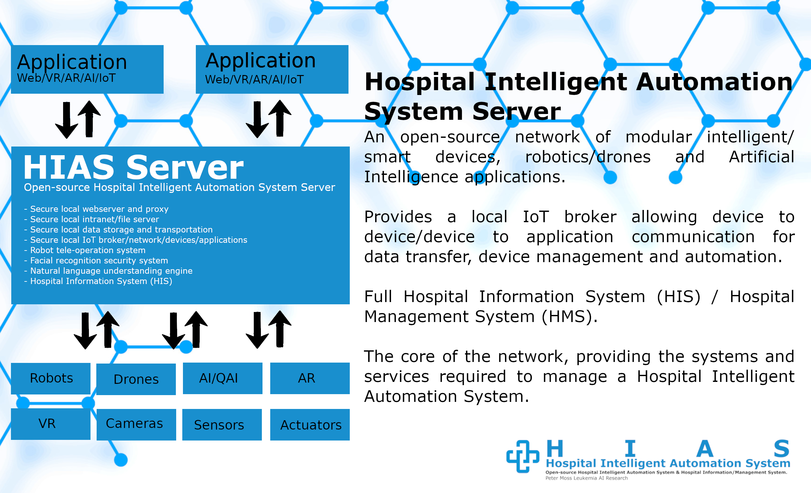
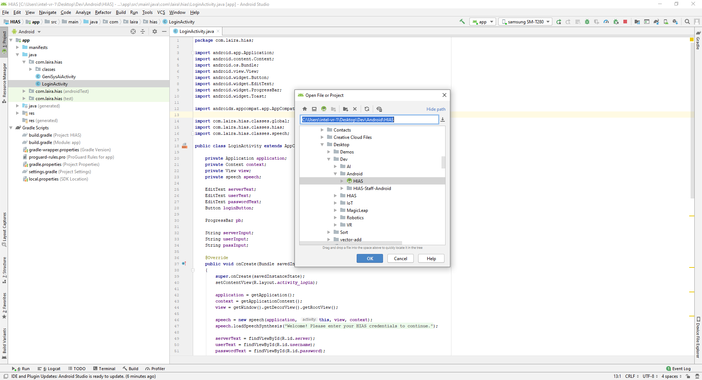
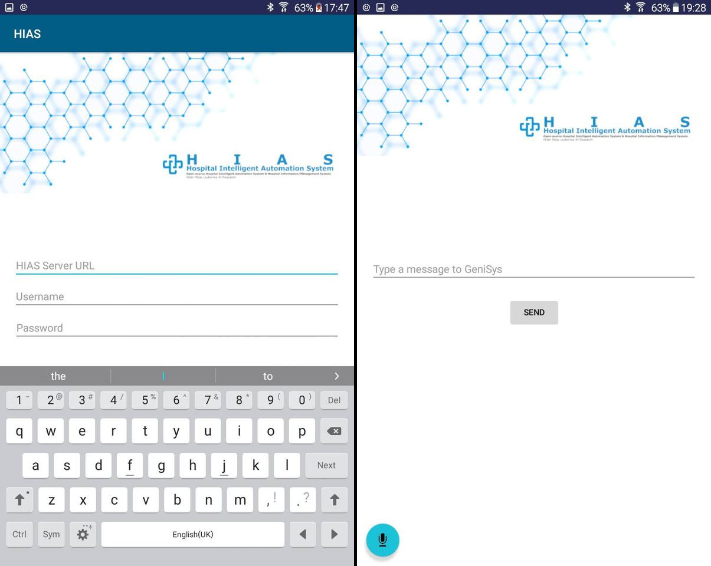

# Asociacion De Investigacion En Inteligencia Artificial Para La Leucemia Peter Moss
## HIAS Staff Android Application

     

&nbsp;

# Table Of Contents

- [Introduction](#introduction)
- [Hospital Intelligent Automation System](#hias-network-map)
- [HIAS GeniSysAI Natural Language Understanding Engines](#hias-genisysai-natural-language-understanding-engines)
- [Installation](#installation)
- [Usage](#usage)
- [Contributing](#contributing)
    - [Contributors](#contributors)
- [Versioning](#versioning)
- [License](#license)
- [Bugs/Issues](#bugs-issues)

&nbsp;

# Introduction
The **Asociacion De Investigacion En Inteligencia Artificial Para La Leucemia Peter Moss HIAS Staff Android Application** is an open-source Android application that allows HIAS staff members to communicate with a [HIAS GeniSysAI Natural Language Understanding Engine](https://github.com/LeukemiaAiResearch/GeniSysAI#natural-language-understanding-engines).

&nbsp;

# HIAS Hospital Intelligent Automation System

The [Hospital Intelligent Automation System](https://github.com/LeukemiaAiResearch/HIAS) is an open-source Hospital Intelligent Automation System. The system's server powers an intelligent network using a locally hosted, encrypted IoT server and proxy.

The server UI provides the capabalities of managing a network of open-soruce intelligent devices and applications. These devices/applications and databases all run and communicate on the local network. This means that premises have more control and security when it comes to their hardware, data and storage.

&nbsp;

# HIAS GeniSysAI Natural Language Understanding Engines
The [HIAS GeniSysAI Natural Language Understanding Engines](https://github.com/LeukemiaAiResearch/GeniSysAI#natural-language-understanding-engines) can be communicated with via the HIAS network allowing applications and devices to have realtime spoken interactions with known and unknown users.

&nbsp;

# Installation
To install the HIAS Staff Android Application, follow the [installation guide](Documentation/Installation.md).

&nbsp;

# Usage

Now you have everything set up, open up Android Studio and open the Android application by doing the following in Android Studio: **File->Open** then navigate to the [Android](Android) folder and open the **HIAS** project.

Now make sure your Natural Language Understanding Engine is online and your speaker is plugged in. Plug your Android device into your computer using a USB cable, and in the top right of Android Studio, choose your Android device and hit the play button (run).

Now enter your HIAS Server URL, your HIAS public API and private keys, and click **SIGN IN**. Providing you have entered the correct details you will be forwarded to the GeniSysAI communication area. From here you can either use the text input to write a message or you can use the speech recognition feature by clicking on the microphone button and speaking.

When you do either of the above mentioned actions, the HIAS server will first see if you have been detected by one of the facial recognition systems in the last five minutes. If you have, it will check if there is an active NLU engine in the zone you were seen in. If there is, the request will be sent to the NLU in Audio mode which means that the response will come from the speaker attached to that NLU. If you are not in a zone with an NLU, or you are outside of the iotJumpWay location, the server will check for an online NLU engine anywhere in the location, if there is one then the request will be sent as a standard inference and the application will speak the response. If no active NLUs are found, the app will tell you so.

&nbsp;

# Contributing

Asociacion De Investigacion En Inteligencia Artificial Para La Leucemia Peter Moss encourages and welcomes code contributions, bug fixes and enhancements from the Github community.

Please read the [CONTRIBUTING](CONTRIBUTING.md "CONTRIBUTING") document for a full guide to forking our repositories and submitting your pull requests. You will also find information about our code of conduct on this page.

## Contributors

- [Adam Milton-Barker](https://www.leukemiaresearchassociation.ai.com/team/adam-milton-barker "Adam Milton-Barker") - [Asociacion De Investigacion En Inteligencia Artificial Para La Leucemia Peter Moss](https://www.leukemiaresearchassociation.ai "Asociacion De Investigacion En Inteligencia Artificial Para La Leucemia Peter Moss") President/Founder & Intel Software Innovator, Sabadell, Spain

&nbsp;

# Versioning

We use SemVer for versioning. For the versions available, see [Releases](releases "Releases").

&nbsp;

# License

This project is licensed under the **MIT License** - see the [LICENSE](LICENSE "LICENSE") file for details.

&nbsp;

# Bugs/Issues

We use the [repo issues](issues "repo issues") to track bugs and general requests related to using this project. See [CONTRIBUTING](CONTRIBUTING.md "CONTRIBUTING") for more info on how to submit bugs, feature requests and proposals.